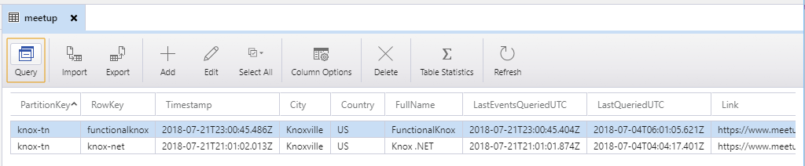

# gatsby-source-azure-storage

Source plugin for pulling data into Gatsby from Azure Storage.  Wrapper around [Azure-Storage-Node](https://github.com/Azure/azure-storage-node)

## How to use

```javascript
// In your gatsby-config.js
module.exports = {
  plugins: [
    {
      resolve: "gatsby-source-azure-storage",
      options: {
        tables: [
          {
            name: "<tableName1>"
          },
          {
            name: "<tableName2>",
            type: "<tableNameTypeLabel2>"
          }
        ],
        containers: [
          {
            name: "<containerName1>",
            // If defined, downloads the blobs in this container to this folder.
            localFolder: 'test2'
          }
        ],
        // If defined, downloads the blobs in all containers above (unless overriden on the container) to this folder.
        containerLocalFolder: 'test'
      },
    }
  ],
}
```

## Environment variables

* AZURE_STORAGE_ACCOUNT and AZURE_STORAGE_ACCESS_KEY
* or
* AZURE_STORAGE_CONNECTION_STRING.

## Example: reading table from Azure Storage



gatsby-config.js looks like this:

```javascript
module.exports = {
  plugins: [
    {
      resolve: "gatsby-source-azure-storage",
      options: {
        tables: [
          {
            name: "meetup"
          },
          {
            name: "events",
            type: "eventTypeName"
          }
        ],
        containers: [
          {
            name: "container1",
            // If defined, downloads the files in this container to this folder.
            localFolder: 'test2'
          }
        ],
        // If defined, downloads the files in all containers (unless overriden on the container) to this folder.
        containerLocalFolder: 'test'
      },
    }
  ]
}
```

Below is a sample query for fetching the above table's rows, as well as the other metadata available.

```graphql
query exampleQuery {
  allMeetup {
    edges {
      node {
        PartitionKey
        RowKey
        LastEventsQueriedUTC
        LastQueriedUTC
        Timestamp
        FullName
        MembersCount
        City
        State
        Country
        Timezone
        Link
        id
      }
    }
  }
  allAzureContainer {
    edges {
      node {
        id
        name
        localFolder
      }
    }
  }
  allAzureTable {
    edges {
      node {
        name
        type
        id
      }
    }
  }
  allAzureBlob {
    edges {
      node {
        id
        localPath
        name
        container
        contentMD5
        blobType
        creationTime
        lastModified
      }
    }
  }
}
```
